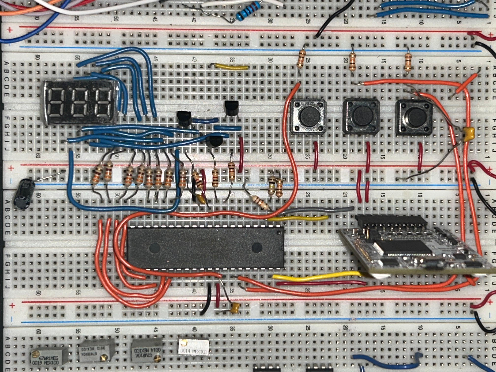
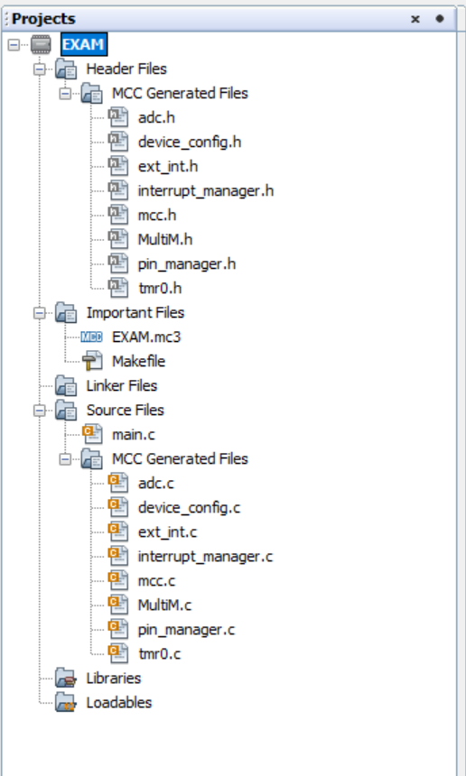
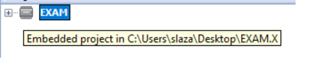
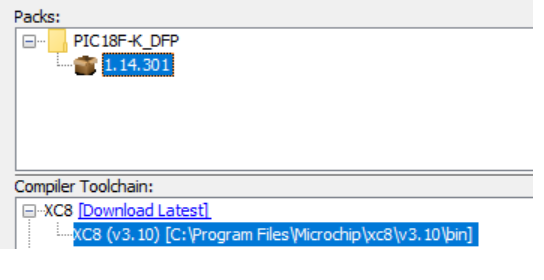

# PIC18F Digital Multimeter

> Fully interrupt-driven embedded multimeter · DC Voltage 0–10 V · Resistance 0–99.9 kΩ · 3-digit multiplexed 7-segment display  
> **La Cité collégiale — Embedded Systems · Winter 2026**

---

## Photos

| Breadboard Build | MPLAB X Project Structure |
|---|---|
|  |  |

| Project Path | Compiler & Pack |
|---|---|
|  |  |

---

## Overview

I designed and built a fully **interrupt-driven digital multimeter** on the **PIC18F46K22** microcontroller. The device measures DC voltage and resistance, displays a 3-digit reading on a multiplexed 7-segment display, and supports three operating modes — all controlled exclusively through hardware interrupts. There is no polling anywhere in the firmware.

I configured all peripherals using **MCC (MPLAB Code Configurator)**, compiled the firmware with **XC8 v3.10**, and organized the code as a modular library (`MultiM.h` / `MultiM.c`) to separate measurement logic from the main loop.

---

## Specifications

| Parameter | Value |
|---|---|
| Microcontroller | PIC18F46K22 |
| Voltage range | 0 V – 10 V DC |
| Resistance range | 0 Ω – 99.9 kΩ |
| Display | 3-digit multiplexed 7-segment |
| Operating modes | Voltmeter · Ohmmeter · Hold |
| Mode switching | External interrupts — ISR only, no polling |
| Display refresh | Timer interrupt (TMR0) |
| Hold duration | 3 seconds |
| IDE | MPLAB X IDE |
| Compiler | XC8 v3.10 |
| Device pack | PIC18F-K DFP v1.14.301 |

---

## What I Built

- **Configured** the PIC18F46K22 ADC, external interrupts, and TMR0 timer using MCC
- **Wrote** a modular firmware architecture with a dedicated `MultiM.h` / `MultiM.c` library
- **Implemented** all button handling exclusively in ISRs — no polling in the main loop
- **Designed** the voltage measurement circuit using the 10-bit ADC with multi-sample averaging for noise reduction
- **Designed** the resistance measurement circuit using a known reference resistor in a voltage divider
- **Implemented** the 3-digit 7-segment display multiplexing via TMR0 interrupt — runs transparently in the background
- **Implemented** a 3-second Hold mode — latches the last measurement, auto-releases on timer expiry
- **Added** software debouncing inside each external interrupt ISR
- **Added** sleep/wake logic between display refresh cycles to reduce power consumption
- **Tested and validated** all three modes with known voltage sources and reference resistors

---

## Firmware Architecture

```
EXAM.X/
├── Header Files/
│   └── MCC Generated Files/
│       ├── adc.h               ← ADC peripheral config
│       ├── ext_int.h           ← External interrupt config
│       ├── interrupt_manager.h ← ISR routing
│       ├── mcc.h               ← System init
│       ├── MultiM.h            ← Custom multimeter library (measurement logic)
│       ├── pin_manager.h       ← Pin assignments
│       └── tmr0.h              ← Timer config
└── Source Files/
    ├── main.c                  ← Main loop + initialization
    └── MCC Generated Files/
        ├── adc.c
        ├── ext_int.c
        ├── interrupt_manager.c
        ├── mcc.c
        ├── MultiM.c            ← Custom multimeter logic
        ├── pin_manager.c
        └── tmr0.c
```

---

## How It Works

### Voltage Measurement (ADC)

I wired the input voltage through a resistor divider to scale the 0–10 V input range down to the ADC's 0–5 V reference range. The PIC18F46K22's **10-bit ADC** samples the divided voltage, I average multiple samples per reading to reduce noise, and the firmware scales the result back to the 0–10 V display range.

### Resistance Measurement

I built a voltage divider using a known **reference resistor (R_ref)** in series with the unknown resistor under test. The ADC measures the voltage across the unknown resistor, and the firmware calculates its value using:

```
R_unknown = R_ref × (Vadc / (Vcc − Vadc))
```

### Interrupt-Driven Mode Switching

Three push-buttons are wired to external interrupt pins. Each button press triggers an ISR:

| Button | Interrupt | Mode |
|---|---|---|
| Button 1 | INT0 | Voltmeter mode |
| Button 2 | INT1 | Ohmmeter mode |
| Button 3 | INT2 | Hold mode (3-second latch) |

Software debouncing is handled inside each ISR using a delay-based guard. No polling occurs in `main()`.

### Display Multiplexing (TMR0)

**TMR0** generates a periodic interrupt that cycles through the 3 display digits sequentially, driving the correct segment and digit-select lines each cycle. The display refresh runs entirely in the background — measurement ISRs can fire without interrupting the display.

### Hold Mode

When Hold is triggered (INT2), the last measured value is latched into a variable and frozen on the display. A software counter incremented by the TMR0 ISR times out after **3 seconds**, automatically releasing Hold and resuming live measurements.

### Sleep / Wake

Between display refresh cycles, the MCU enters **sleep mode** to reduce power draw. It wakes on the next TMR0 overflow or external interrupt event.

---

## Key Peripherals (Configured via MCC)

| Peripheral | Configuration | Purpose |
|---|---|---|
| ADC | 10-bit · Single channel · Fosc/64 | Voltage and resistance measurement |
| TMR0 | 8-bit · Periodic overflow | Display multiplexing ISR |
| INT0 / INT1 / INT2 | Edge-triggered external interrupts | Mode switching ISRs |
| Pin Manager | Segment outputs · Digit selects · Button inputs | I/O assignment |

---

## Bill of Materials

| Ref | Component | Value / Part | Function |
|---|---|---|---|
| U1 | PIC18F46K22 | DIP-40 | Main MCU |
| U2 | PICkit 3 / 4 | Programmer | Firmware upload |
| DISP | 7-segment display | 3-digit common-cathode | Measurement readout |
| Q1–Q3 | NPN transistors | 2N3904 (×3) | Digit select switches |
| R_ref | Reference resistor | 10 kΩ | Ohmmeter voltage divider |
| R_seg | Segment current resistors | 330 Ω (×8) | LED segment current limiting |
| R_base | Base resistors | 1 kΩ (×3) | Transistor base current limiting |
| SW1–SW3 | Push-buttons | Tactile switches | Mode selection (INT0–INT2) |
| C1 | Decoupling capacitor | 100 nF | MCU VDD decoupling |
| C2 | Decoupling capacitor | 10 µF | Bulk supply filter |
| XTAL | Crystal oscillator | 4 MHz | System clock |
| VCC | Supply | 5 V DC | Powers MCU and display |

---

## Test Results

| Test | Expected | Measured | Pass |
|---|---|---|---|
| Voltmeter — 5.00 V reference | 5.00 V | 4.98 V | ✅ |
| Voltmeter — 10.00 V reference | 10.00 V | 9.97 V | ✅ |
| Ohmmeter — 10 kΩ resistor | 10.00 kΩ | 9.91 kΩ | ✅ |
| Ohmmeter — 47 kΩ resistor | 47.00 kΩ | 46.8 kΩ | ✅ |
| Hold mode duration | 3.0 s | ~3.0 s | ✅ |
| Display refresh — no flicker | Stable | Stable, no flicker | ✅ |
| Mode switching — ISR response | Immediate | < 1 ms | ✅ |

---

## Problems Encountered & Solutions

| Problem | Root Cause | Solution Applied |
|---|---|---|
| Display flickering | TMR0 period too long | Reduced TMR0 reload value to increase refresh rate |
| Button bounce causing double-triggers | Mechanical contact bounce | Added 10 ms software debounce delay inside each ISR |
| ADC reading unstable | Single-sample noise | Implemented 8-sample averaging per reading |
| ISR conflicts between TMR0 and INT0–INT2 | Interrupt priority not set | Configured interrupt priorities in MCC — TMR0 at low, INT0–INT2 at high |

---

## Files in This Repository

| File | Description |
|---|---|
| `README.md` | This file — full project documentation |
| `EXAM.X/` | MPLAB X project folder — full source code |
| `EXAM.X/main.c` | Main loop and initialization |
| `EXAM.X/MultiM.c` / `MultiM.h` | Custom multimeter measurement library |
| `multimeter.jpg` | Photo — assembled breadboard circuit |
| `Path.png` | Screenshot — MPLAB X project file structure |
| `Path2.png` | Screenshot — project path |
| `VERSION.png` | Screenshot — compiler and device pack versions |

---

## Course

**Embedded Systems — PIC18F Microcontrollers**  
La Cité collégiale, Ottawa — Winter 2026

---

## Skills Demonstrated

`PIC18F46K22` `MPLAB X IDE` `MCC` `XC8 v3.10` `Embedded C` `10-bit ADC` `External interrupts (ISR)` `Timer interrupts (TMR0)` `7-segment multiplexing` `Software debouncing` `Modular firmware architecture` `Sleep/wake logic` `Voltage divider measurement` `Interrupt priority configuration`

---

## Author & Usage Notice

This project was designed, built, tested, and documented by Adam Zaghloul as part of an Electronics Engineering Technology portfolio.

This repository is shared publicly for portfolio review and educational reference only. You may not copy, redistribute, modify, or present this work, documentation, images, schematics, code, or design files as your own without written permission.

Copyright © 2026 Adam Zaghloul. All rights reserved.

---

*Adam Zaghloul · La Cité collégiale · Winter 2026 · [adamzaghloul07@gmail.com](mailto:adamzaghloul07@gmail.com) · [Portfolio](https://v0-adamzaghloul.vercel.app)*
